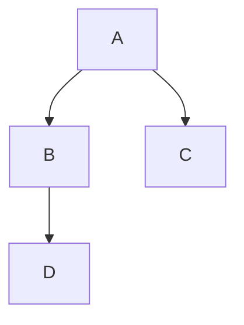
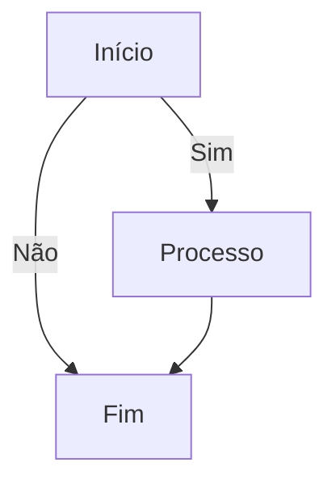
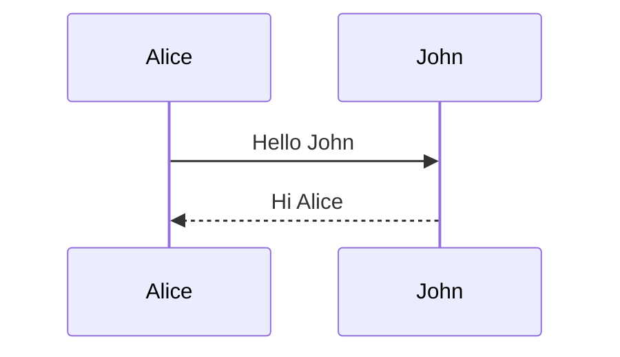
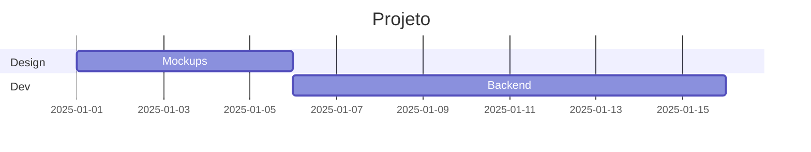
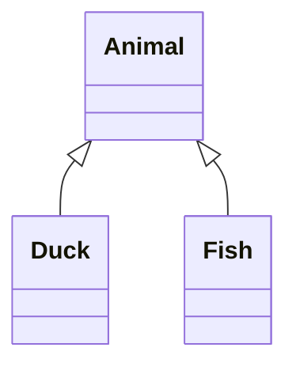

# Markdown: A Linguagem Universal de Escrita para Web

Markdown é uma das ferramentas mais subestimadas no desenvolvimento. Parece simples demais para ser importante, mas está em todo lugar: GitHub, blogs, documentação, Slack, Discord, Reddit, e até nos prompts que você escreve para IAs.

Este guia vai te mostrar por que Markdown é essencial, como usar, e como ele se integra no ecossistema de desenvolvimento moderno.

## O Que É Markdown?

Markdown é linguagem de marcação leve. Você escreve texto simples com alguns caracteres especiais (`#`, `*`, `-`) e ele converte para HTML formatado.

**Exemplo básico:**

```markdown
# Título
Parágrafo normal com **negrito** e *itálico*.

- Item 1
- Item 2
```

Vira:

```html
<h1>Título</h1>
<p>Parágrafo normal com <strong>negrito</strong> e <em>itálico</em>.</p>
<ul>
  <li>Item 1</li>
  <li>Item 2</li>
</ul>
```

A ideia é escrever de forma legível mesmo no formato texto puro, diferente de HTML que fica cheio de tags.

## História do Markdown

### Criação (2004)

Markdown foi criado por **John Gruber** em 2004, com ajuda de **Aaron Swartz**. John mantinha blog Daring Fireball e queria jeito mais fácil de escrever posts.

HTML era muito verboso. Outras linguagens de marcação (como BBCode em fóruns) eram limitadas. Ele criou algo no meio termo: simples de escrever, mas poderoso o suficiente.

### Filosofia Original

A ideia de John Gruber:

> "Markdown is intended to be as easy-to-read and easy-to-write as is feasible."

O objetivo era que texto Markdown fosse **legível sem conversão**. Mesmo sem renderizar, você entende a estrutura.

Compare:

```html
<h2>Título</h2>
<p>Parágrafo com <strong>ênfase</strong>.</p>
```

vs

```markdown
## Título
Parágrafo com **ênfase**.
```

O segundo é mais limpo, mais humano.

### Crescimento e Fragmentação

Markdown explodiu em popularidade. GitHub adotou em 2008 para READMEs. Stack Overflow, Reddit, Discord seguiram.

Mas surgiram variações: GitHub Flavored Markdown (GFM), CommonMark, MultiMarkdown, cada um com extensões próprias.

**CommonMark** (2014) tentou padronizar a sintaxe. Hoje é a especificação mais próxima de padrão universal.

### Estado Atual (2025)

Markdown é onipresente:

- **GitHub/GitLab**: READMEs, issues, PRs, wikis
- **Blogs**: Jekyll, Hugo, Gatsby usam Markdown
- **Documentação**: Muitos projetos (React, Vue, Next.js)
- **Notas**: Obsidian, Notion, Roam Research
- **Mensageiros**: Discord, Slack, WhatsApp (parcialmente)
- **CMSs Headless**: Contentful, Strapi, Sanity
- **IAs**: ChatGPT, Claude aceitam e geram Markdown

É a língua franca da escrita técnica na web.

## Fundamentos: Sintaxe Básica

### Cabeçalhos

```markdown
# H1 - Título Principal
## H2 - Subtítulo
### H3 - Seção
#### H4 - Subseção
##### H5 - Menor ainda
###### H6 - Menor possível
```

Quantidade de `#` define o nível (1 a 6).

### Parágrafos e Quebras de Linha

Parágrafos são separados por linha em branco:

```markdown
Primeiro parágrafo.

Segundo parágrafo.
```

Quebra de linha dentro do parágrafo: duas espaços no final da linha ou `<br>`.

### Ênfase

```markdown
*itálico* ou _itálico_
**negrito** ou __negrito__
***negrito e itálico***
~~tachado~~
```

### Listas

**Não ordenadas:**

```markdown
- Item 1
- Item 2
  - Subitem 2.1
  - Subitem 2.2
- Item 3
```

Pode usar `-`, `*` ou `+`.

**Ordenadas:**

```markdown
1. Primeiro
2. Segundo
3. Terceiro
```

Números não precisam estar na ordem correta. Markdown corrige automaticamente.

### Links

```markdown
[Texto do link](https://exemplo.com)
[Link com título](https://exemplo.com "Título ao passar mouse")
```

**Links de referência** (útil para reusar):

```markdown
Veja [documentação][doc] e [tutorial][tut].

[doc]: https://docs.exemplo.com
[tut]: https://tutorial.exemplo.com
```

### Imagens

```markdown


```

Sintaxe igual a links, mas com `!` na frente.

### Código

**Inline:**

```markdown
Use função `console.log()` para debugar.
```

**Bloco:**

````markdown
```javascript
function hello() {
  console.log("Hello, world!");
}
```
````

Especificar linguagem após as três crases habilita syntax highlighting.

### Citações

```markdown
> Isto é uma citação.
> Pode ter múltiplas linhas.
>
> E parágrafos separados.
```

### Linhas Horizontais

```markdown
---
***
___
```

Três ou mais hífens, asteriscos ou underscores.

### Tabelas (GFM)

```markdown
| Coluna 1 | Coluna 2 | Coluna 3 |
|----------|----------|----------|
| Linha 1  | Dado     | Valor    |
| Linha 2  | Mais     | Coisas   |
```

Alinhamento:

```markdown
| Esquerda | Centro | Direita |
|:---------|:------:|--------:|
| Texto    | Texto  | Texto   |
```

`:` define alinhamento.

### Task Lists (GFM)

```markdown
- [x] Tarefa completa
- [ ] Tarefa pendente
- [ ] Outra pendente
```

Muito usado em issues do GitHub.

## Vantagens do Markdown

### 1. Simplicidade

Aprende em 15 minutos. Não precisa memorizar tags HTML complexas. Escrita flui naturalmente.

### 2. Legibilidade

Texto Markdown é legível sem renderizar. READMEs no GitHub são compreensíveis mesmo em texto puro.

### 3. Portabilidade

Arquivo `.md` é texto puro. Abre em qualquer editor. Não fica preso a software proprietário.

Diferente de Word (`.docx`) que precisa de software específico.

### 4. Versionamento

Git funciona perfeitamente com Markdown. Diffs são claros. Você vê exatamente o que mudou:

```diff
- ## Título Antigo
+ ## Título Novo
```

### 5. Conversão Fácil

Markdown converte para vários formatos: HTML, PDF, DOCX, LaTeX, slides. Ferramentas como Pandoc fazem isso automaticamente.

### 6. Foco no Conteúdo

Sem distrações de formatação visual. Você escreve conteúdo, não mexe em fontes e margens.

### 7. Integração com Ferramentas Dev

GitHub, VSCode, editores de código, geradores de site estático, todos entendem Markdown nativamente.

### 8. SEO Friendly

Conversão para HTML semântico perfeito. Headings corretos (H1, H2, H3), estrutura clara. Google adora isso.

### 9. Velocidade

Escrever Markdown é mais rápido que HTML. Menos caracteres, menos sintaxe para lembrar.

### 10. Multiplataforma

Funciona igual em Windows, Mac, Linux, web, mobile. É só texto.

## Limitações do Markdown

Markdown não é perfeito. Tem limitações:

### 1. Formatação Complexa

Não tem controle fino sobre layout. Quer texto em duas colunas? Margin específica? Cor de fundo? Markdown não faz.

**Solução**: Mistura HTML quando precisa. Markdown aceita HTML inline:

```markdown
# Título

<div style="color: red;">
  Texto vermelho.
</div>
```

### 2. Falta de Padronização

Várias "sabores" de Markdown. O que funciona no GitHub pode não funcionar em outras plataformas.

**Solução**: Use CommonMark como base, adicione extensões conforme necessário.

### 3. Tabelas Complexas

Tabelas com células mescladas, tabelas aninhadas, formatação avançada: Markdown não suporta bem.

**Solução**: Use HTML para tabelas complexas.

### 4. Fórmulas Matemáticas

Markdown puro não tem sintaxe para matemática. Precisa de extensões como KaTeX ou MathJax:

```markdown
$$E = mc^2$$
```

Nem todos parsers suportam.

### 5. Diagramas

Não tem sintaxe nativa para fluxogramas, diagramas UML, etc.

**Solução**: Extensões como Mermaid:



### 6. Metadados

Markdown puro não tem lugar para metadados (autor, data, tags).

**Solução**: YAML frontmatter:

```markdown
---
title: Meu Post
date: 2025-01-15
tags: [web, markdown]
---

# Conteúdo aqui
```

### 7. Interatividade

Markdown é estático. Não tem buttons, forms, JavaScript interativo direto.

**Solução**: Mistura com HTML/JavaScript quando precisa.

## Markdown para Prompts de IA

Uso interessante: escrever prompts para IAs como ChatGPT e Claude.

### Por Que Usar Markdown em Prompts?

**Estrutura clara**: IA entende hierarquia (H1, H2, listas).

**Código formatado**: Blocos de código ficam distintos do texto.

**Instruções organizadas**: Listas numeradas para passos sequenciais.

**Legibilidade**: Você e a IA entendem melhor o prompt.

### Exemplo de Prompt com Markdown

````markdown
# Tarefa: Criar landing page

## Requisitos

- Responsiva
- Header fixo
- Seção hero com CTA
- Footer com links sociais

## Tecnologias

Use:

```html
HTML5, CSS3, JavaScript vanilla
```

## Output esperado

Retorne código completo em artifact.
````

Compare com prompt sem formatação:

```
cria landing page responsiva com header fixo seção hero com cta footer com links sociais usa html5 css3 javascript vanilla retorna código completo
```

Primeiro é muito mais claro.

### Boas Práticas

**1. Use headings para seções principais**

```markdown
# Objetivo Principal
## Contexto
## Requisitos
## Constraints
```

**2. Listas para enumerações**

```markdown
Preciso que você:
1. Analise o código
2. Encontre bugs
3. Sugira melhorias
```

**3. Blocos de código para exemplos**

````markdown
Corrija este JavaScript:

```javascript
function soma(a, b) {
  return a + b
}
```
````

**4. Citações para destacar informações importantes**

```markdown
> IMPORTANTE: Não use bibliotecas externas
```

**5. Negrito para ênfase**

```markdown
O código deve ser **extremamente performático** e **acessível**.
```

## Markdown para Blogs

Markdown é perfeito para blogs técnicos. Muitos geradores de sites estáticos usam Markdown como formato principal.

### Geradores Populares

**Jekyll**: Ruby-based, usado pelo GitHub Pages

**Hugo**: Go-based, extremamente rápido

**Gatsby**: React-based, rico em plugins

**Next.js**: React com SSG, muito flexível

**Eleventy (11ty)**: JavaScript, simples

**Astro**: Multi-framework, moderno

### Workflow Típico

1. Escreve post em Markdown (`.md`)
2. Adiciona frontmatter com metadados
3. Coloca arquivo em pasta `/posts/`
4. Gerador processa e cria HTML
5. Deploy automático

### Exemplo de Post de Blog

```markdown
---
title: "Como Usar Flexbox"
date: 2025-01-15
author: João Silva
tags: [css, frontend, tutorial]
description: Guia completo sobre CSS Flexbox
---

# Como Usar Flexbox

Flexbox é técnica de layout CSS poderosa...

## O Que É Flexbox

Flexbox (Flexible Box Layout) permite...

## Propriedades Principais

### justify-content

Alinha itens no eixo principal:

```css
.container {
  display: flex;
  justify-content: center;
}
```

### align-items

Alinha itens no eixo transversal...
```

Gerador converte isso em página HTML completa com layout, header, footer, navegação, tudo automaticamente.

### Vantagens para Blogging

**Foco na escrita**: Não se distrai com editor visual

**Versionamento**: Posts vão para Git, tem histórico completo

**Performance**: Sites gerados são super rápidos

**Portabilidade**: Posts são seus, não presos em plataforma

**Customização**: Controle total sobre HTML gerado

## Markdown para Documentação

Projetos open source usam Markdown massivamente para docs.

### Estrutura Típica

```
projeto/
  ├── README.md (introdução)
  ├── docs/
  │   ├── getting-started.md
  │   ├── api-reference.md
  │   ├── examples.md
  │   └── faq.md
  └── CONTRIBUTING.md
```

### README.md: Porta de Entrada

README é primeira coisa que pessoas veem no GitHub. Bom README tem:

```markdown
# Nome do Projeto

Descrição breve e clara do que faz.

## Instalação

```bash
npm install meu-projeto
```

## Uso Básico

```javascript
const projeto = require('meu-projeto');
projeto.fazer();
```

## Documentação Completa

Veja [docs/](docs/) para mais detalhes.

## Licença

MIT
```

### Documentação Multi-Página

Ferramentas como **Docusaurus**, **VuePress**, **MkDocs** geram sites de documentação lindos a partir de Markdown.

Você escreve arquivos `.md`, ferramenta gera site navegável com busca, sidebar, versões, tudo automaticamente.

## Integrações e Bibliotecas

Ecossistema Markdown é rico. Muitas libs para processar, renderizar, estender.

### Parsers (Convertem Markdown → HTML)

**marked.js** (JavaScript)

```javascript
import { marked } from 'marked';
const html = marked('# Hello');
```

Simples, rápido, popular.

**markdown-it** (JavaScript)

```javascript
const md = require('markdown-it')();
const html = md.render('# Hello');
```

Extensível, suporta plugins.

**remark** (JavaScript, unificado)

```javascript
import { remark } from 'remark';
import html from 'remark-html';

remark().use(html).process('# Hello');
```

Parte do ecossistema unified, muito poderoso.

**CommonMark** (C, tem bindings para várias linguagens)

Implementação de referência da spec CommonMark.

### Extensões

**markdown-it-anchor**: Adiciona IDs em headings

**remark-gfm**: GitHub Flavored Markdown (tabelas, task lists)

**remark-math**: Suporte a fórmulas matemáticas

**remark-mermaid**: Diagramas

**markdown-it-emoji**: Emojis :smile:

**rehype-highlight**: Syntax highlighting para código

### Editores Markdown

**VSCode**: Suporte nativo, preview ao lado

**Typora**: WYSIWYG Markdown, muito limpo

**Obsidian**: Para notas interligadas

**Mark Text**: Open source, multiplataforma

**iA Writer**: Minimalista, focado em escrita

**Dillinger**: Editor online

### Preview em Tempo Real

**browser-sync**: Atualiza navegador automaticamente

**live-server**: Servidor com hot reload

**Markdown Preview Enhanced** (VSCode extension): Preview sofisticado com suporte a Mermaid, KaTeX, etc.

## Pandoc: O Canivete Suíço

**Pandoc** é ferramenta de conversão universal de documentos. Converte Markdown para praticamente qualquer formato.

### Instalação

```bash
# macOS
brew install pandoc

# Linux
sudo apt-get install pandoc

# Windows
choco install pandoc
```

### Conversões Comuns

**Markdown → HTML**

```bash
pandoc input.md -o output.html
```

**Markdown → PDF** (precisa de LaTeX instalado)

```bash
pandoc input.md -o output.pdf
```

**Markdown → DOCX** (Word)

```bash
pandoc input.md -o output.docx
```

**Markdown → LaTeX**

```bash
pandoc input.md -o output.tex
```

**Markdown → Slides** (reveal.js)

```bash
pandoc input.md -t revealjs -s -o slides.html
```

### Templates Customizados

Pandoc aceita templates para controlar output:

```bash
pandoc input.md --template=meu-template.html -o output.html
```

### Metadados com YAML

```markdown
---
title: Meu Documento
author: João Silva
date: 2025-01-15
---

# Conteúdo
```

Pandoc usa metadados na conversão (título do PDF, cabeçalhos, etc).

### Casos de Uso

**Ebooks**: Escreve em Markdown, gera EPUB ou MOBI

**Artigos acadêmicos**: Markdown → LaTeX → PDF com referências

**Apresentações**: Markdown → reveal.js slides

**Relatórios**: Markdown → DOCX para compartilhar com não-técnicos

## Block Codes: Destaque de Sintaxe

Code blocks são parte essencial do Markdown técnico. Syntax highlighting torna código legível.

### Sintaxe Básica

````markdown
```javascript
function hello() {
  console.log("Hello!");
}
```
````

Três crases + nome da linguagem.

### Linguagens Suportadas

Depende do parser, mas comum:

- `javascript`, `js`
- `python`, `py`
- `html`
- `css`
- `bash`, `shell`
- `json`
- `markdown`, `md`
- `sql`
- `yaml`
- `typescript`, `ts`
- `jsx`, `tsx`
- `php`
- `ruby`
- `go`
- `rust`
- `java`
- `c`, `cpp`

### Highlighting na Prática

**Prism.js**

```html
<link href="prism.css" rel="stylesheet" />
<script src="prism.js"></script>
```

Detecta `<pre><code class="language-js">` e aplica highlight.

**Highlight.js**

```html
<link rel="stylesheet" href="highlight.css">
<script src="highlight.js"></script>
<script>hljs.highlightAll();</script>
```

Auto-detecta linguagem se não especificada.

**Shiki** (usado por VSCode)

```javascript
import { getHighlighter } from 'shiki';

const highlighter = await getHighlighter({ theme: 'nord' });
const html = highlighter.codeToHtml(code, { lang: 'js' });
```

Usa mesmas gramáticas que VSCode. Highlight perfeito.

### Line Numbers

Alguns parsers suportam:

````markdown
```javascript {1,3-5}
const a = 1;  // highlighted
const b = 2;
const c = 3;  // highlighted
const d = 4;  // highlighted
const e = 5;  // highlighted
```
````

### Diff Highlighting

````markdown
```diff
- código removido
+ código adicionado
  código sem mudança
```
````

## Mermaid: Diagramas em Markdown

Mermaid permite criar diagramas usando sintaxe texto dentro de Markdown.

### Tipos de Diagramas

**Flowchart**

````markdown

````

**Sequence Diagram**

````markdown

````

**Gantt Chart**

````markdown

````

**Class Diagram**

````markdown

````

### Integração

**GitHub**: Suporte nativo

**GitLab**: Suporte nativo

**Docusaurus, VuePress, etc**: Plugins disponíveis

**VSCode**: Extensões como "Markdown Preview Mermaid Support"

### Alternativas

**PlantUML**: Mais poderoso, sintaxe diferente

**Graphviz**: Grafos complexos

**Asciiflow**: Diagramas ASCII art

## Markdown e SEO

Sites gerados de Markdown podem ter SEO excelente se bem configurados.

### Estrutura Semântica

Markdown gera HTML semântico correto:

- `#` → `<h1>`
- `##` → `<h2>`
- Listas → `<ul>`, `<ol>`
- Ênfase → `<strong>`, `<em>`

Google valoriza hierarquia clara.

### Meta Tags via Frontmatter

```markdown
---
title: "Guia Completo de Flexbox"
description: "Aprenda CSS Flexbox com exemplos práticos"
keywords: "flexbox, css, layout, frontend"
author: "João Silva"
---
```

Gerador usa isso para criar meta tags:

```html
<title>Guia Completo de Flexbox</title>
<meta name="description" content="Aprenda CSS Flexbox...">
```

### URLs Limpas

Geradores transformam:

```
posts/guia-flexbox.md → /posts/guia-flexbox/
```

URLs limpas sem `.html` são melhores para SEO.

### Open Graph e Twitter Cards

Frontmatter pode incluir:

```markdown
---
title: "Meu Post"
image: "/images/post-cover.jpg"
---
```

Gerador cria:

```html
<meta property="og:title" content="Meu Post">
<meta property="og:image" content="/images/post-cover.jpg">
```

Essencial para compartilhamento social.

### Sitemap Automático

Geradores criam `sitemap.xml` automaticamente listando todas páginas Markdown. Google indexa melhor.

## Workflows Modernos com Markdown

### Workflow 1: Blog Pessoal

```
Escreve post.md
  → Git commit
    → Push para GitHub
      → GitHub Actions build
        → Deploy Netlify/Vercel
          → Site atualizado
```

Tudo automatizado. Você só escreve e commita.

### Workflow 2: Documentação de Projeto

```
Documenta feature.md
  → PR no GitHub
    → Preview deploy automático
      → Revisão da equipe
        → Merge
          → Docs atualizados
```

Documentação versionada junto com código.

### Workflow 3: Notas Pessoais → Blog

```
Obsidian (notas em .md)
  → Seleciona nota
    → Ajusta frontmatter
      → Copia para blog/posts/
        → Build e deploy
```

Notas pessoais viram posts públicos facilmente.

### Workflow 4: Ebook Multi-Formato

```
Escreve capítulos .md
  → Pandoc → EPUB
  → Pandoc → PDF
  → Pandoc → HTML
```

Mesmo conteúdo, múltiplos formatos.

## Checklist: Dominando Markdown

Use para medir seu progresso:

### Sintaxe Básica

- [ ] Sei criar headings (H1 a H6)
- [ ] Sei formatar texto (negrito, itálico, tachado)
- [ ] Sei criar listas ordenadas e não-ordenadas
- [ ] Sei criar links
- [ ] Sei inserir imagens
- [ ] Sei criar code blocks com syntax highlighting
- [ ] Sei usar citações (blockquotes)
- [ ] Sei criar linhas horizontais

### Sintaxe Avançada

- [ ] Sei criar tabelas
- [ ] Sei usar task lists
- [ ] Sei usar links de referência
- [ ] Sei misturar HTML quando necessário
- [ ] Entendo diferenças entre sabores (GFM, CommonMark)

### Ferramentas

- [ ] Configurei preview Markdown no VSCode
- [ ] Instalei e usei Pandoc para conversões
- [ ] Usei gerador de site estático (Jekyll, Hugo, etc)
- [ ] Criei README.md para projeto no GitHub
- [ ] Escrevi pelo menos um post de blog em Markdown

### Integrações

- [ ] Usei Mermaid para criar diagrama
- [ ] Configurei syntax highlighting (Prism ou Highlight.js)
- [ ] Usei frontmatter YAML para metadados
- [ ] Integrei Markdown com blog ou site

### Uso Prático

- [ ] Escrevo prompts para IA em Markdown
- [ ] Mantenho notas pessoais em Markdown
- [ ] Documento código com arquivos .md
- [ ] Uso Markdown em comunicação (Slack, Discord)
- [ ] Prefiro Markdown a Word para documentos técnicos

### Avançado

- [ ] Criei template customizado Pandoc
- [ ] Automatizei conversão Markdown → PDF
- [ ] Configurei CI/CD para site Markdown
- [ ] Contribuí para projeto open source editando docs .md
- [ ] Criei extensão ou plugin Markdown

## Recursos para Aprender Mais

### Documentação Oficial

- **CommonMark Spec**: https://commonmark.org/
- **GitHub Flavored Markdown**: https://github.github.com/gfm/
- **Markdown Guide**: https://www.markdownguide.org/

### Ferramentas Online

- **Dillinger**: Editor Markdown online
- **StackEdit**: Editor com preview ao vivo
- **HackMD**: Colaboração em tempo real
- **Markdown Tables Generator**: Cria tabelas facilmente

### Cheat Sheets

- **GitHub Markdown Cheatsheet**: Resumo de sintaxe GFM
- **Markdown Guide Cheat Sheet**: Sintaxe básica e estendida
- **Devhints**: https://devhints.io/markdown

### Livros e Tutoriais

- **"Markdown Guide" de Matt Cone**: Livro completo online gratuito
- **Pandoc Manual**: Documentação detalhada de Pandoc
- **CommonMark Tutorial**: Interativo, ensina sintaxe passo a passo

## Conclusão

Markdown é muito mais que sintaxe simples. É filosofia de escrita, formato universal, ponte entre conteúdo e código.

**Para desenvolvedores**: Markdown é documentação, READMEs, blogs técnicos, notas de desenvolvimento.

**Para escritores**: Markdown é foco no conteúdo, portabilidade, liberdade de plataforma.

**Para todos**: Markdown é texto legível que vira HTML, PDF, slides, ebooks.

Domine Markdown e você escreve melhor, documenta melhor, comunica melhor. É habilidade que usa todo dia, em todo projeto.

Comece hoje: escreva seu próximo documento em Markdown. Crie README para projeto. Inicie blog em Markdown. Não vai se arrepender.

**Markdown é simples, mas poderoso. Assim como deveria ser.**